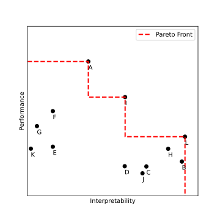

# Lecture 1: Introduction to Explainable AI


## Organisation

### Lecturers

- Responsible lecturer: [Dr. Simone Lionetti](https://www.hslu.ch/en/lucerne-university-of-applied-sciences-and-arts/about-us/people-finder/profile/?pid=4484)
- Lecturer: [Dr. Ludovic Amruthalingam](https://www.hslu.ch/en/lucerne-university-of-applied-sciences-and-arts/about-us/people-finder/profile/?pid=5381)

### Content

- A lecture overview with the topics for each week can be found in the [weekly plan](index.md).
- Note: there will be some **overlap** with the content of AMLMED 2023-2024, since there was no XAI module until now and some basic methods such as feature analysis were covered there.

### Lectures

- Lectures will be mostly **on site without streaming** (this is the HSLU meaning of "vor Ort / online").
- The exceptions are **four lectures** which will be **online only**. These will be the multiples of three (weeks 3, 6, 9, and 12).
- The plan is to have effective times **18:30-19:25** and **19:35-20:30**. The goal is to allow people to take the trains at 20:48-20:49. If there are other specific needs, this can be revised.

### Exam

- The exam will be a single **90 minutes** written test in the **regular exam session**.
- The **style** of the exam will be similar to the modules Advanced Machine Learning (ADML) or Applications of Machine Learning in Medicine (AMLMED). This means that there will be 10-20 different questions or short problems spanning the module topics, requiring qualitative, quantitative, coding, and reasoning answers. It is deliberately **long** compared to the available time to reduce cheating, but the **passing** grade is set around **one third** of fully correct answers, and the **best** grade is around **three quarters**.
- At the exam, no textbooks or electronic devices will be allowed except from an ordinary non-programmable **calculator** and a **hand-written, double sided A4 sheet**. The goal of the exam is testing understanding and reasoning rather than memory, so useful formulae will also be provided as an appendix to the exam text.
- As this is the first edition of the module, there are no previous exams for preparation. To mitigate this, we will give plenty of **exam question examples** during the module.

### Assignments

- We will distribute short assignments and exercises during the lectures.
- The completion of these assignments is left to **individual responsibility**, i.e., we will not check if they have been solved.
- Questions on the exercises are welcome per email, Teams, or ILIAS, and may be discussed in the following lectures if they are of collective interest.

### Materials

- XAI has seen a reinassance around the late 2010s, so **many methods are still in evolution**. There are already some classic textbooks, but they are not very mature yet.
- The main books this module is based on are given on the [main page](index.md#Resources).
- The module will integrate some personal views and experiences from the lecturers.
- Notes will be released as **slides or MarkDown** files with the main concepts in case boards or flipcharts are used. These materials come with **no guarantee of completeness or correctness**.
- It is still recommended to take notes during lectures, as this improves retention, especially if they are handwritten.

### Questions?

-

This lecture will be conceptual, with lots of discussions and very little math.
Hopefully it will be clear (immediately or later on) that the concepts introduced have practical use.
Starting with the next lecture, things should get much more quantitative.

## Motivation

### Explanation example

Consider the example question: **Why are you in this class?**

```diff
! Task
Everyone should answer the question on the spot.
(Don't forget to ask 1-2 people a second time)
```

Example explanations with comments:

- Because I walked in.
	- Cheeky response with no useful information.
- When my cousin Barley had his birthday last September, I talked to my grandmother Evelyn who had a problem with her Samsumg phone not connecting to the closest cell and could not figure out why because the diagnostic button always redirected her to a '404 - Not Found' page. Looking into the Android settings, I discovered that the option for 5G Network was turned on, and her 9.99 CHF contract with Yallo did not include it. I then called customer support, had to wait for half an hour before a real operator picked up - this was so much pain - and was able to have them configure the mobile so that it connected to the network correctly, and grandma was able to talk to Aunt Muriel again after the Sonntagjass - she was so happy! So I realised how important it is to not just get an error message, but also an explanation that is also helpful for people over 75 (grandma is 78) and since I have been studying AIML for 4 semesters and my AGI module was cancelled in the Thursday evening slot, I could subscribe last minute and I'm so lucky and excited about this module!
	- Overly lengthy and hard to understand.
- [Said] The lecturers are so great at explaining and know so much! [Thought] The exam is very easy and I can skip all lectures!
	- Valid answer, but does not correspond to the truth.
- [First time] I want to be able to explain the decisions of the AI systems I produce. [Second time] Explainability is really important to build trust in AI systems.
	- Maybe something has changed in between the two answers, but it is also possible that this is a symptom of uncertainty.
- It's an E42 module of program A66.
	- May make sense but targeted to a very specific audience.

The examples illustrate that explanations may be more or less

- useful (or *informative*);
- complex;
- faithful (or *faithful*);
- consistent.

The answers also demonstrate that their interpretation is dependent from context.
Very technical answers may be useful for some people (like course administrators in the case above) but meaningless for others, depending on the target audience.
The answers would also probably be different if the question had been phrased in a different way, for instance: **Why do you think this course is worthwile?**

```diff
! Task
Count how many people would have phrased the answer differently,
and how many would have changed the content.
```

This also shows that **explanations depend on the question they attempt to answer**, which may be explicit but also implicit.

### Explanation need

The typical lore of the community is that ML and especially DL models are **black boxes**.
Usually this statement means that it is **impossible to look inside** such ML models, or at least that they cannot be understood.

```diff
! Task
Argue whether this is the case or not.
```


In some cases this may be true, for instance if an AI system is provided as an interface where one provides an input and receives an output, as in LLM chats.
However, often the black-box model argument is used even if the full model structure and potentially training details are available.
Examples are a pre-trained neural network downloaded from a model repository, or a random forest trained on a local dataset.
In these cases, **the individual steps used by the model** (neuron activation calculations, tree branching condition) **could be executed by hand**.
However, **the sheer number** makes it very hard for a human to trace **the meaning of each computation**, even if they can technically all be executed individually.
Even though the model can be fully reproduced *in principle*, *in practice* this is not possible, or at least in the process it is really difficult for humans to keep track of what is happening.

It is important to note that explanations are ultimately requested by humans, and therefore have to satisfy criteria established by humans.
For this reason, XAI has strong ties to **cognitive science** and **psychology**.
Also, this is the reason why XAI also has to pay a lot of attention to **visualisations** and User Interfaces (**UI**s).


## Definitions

Now that some context has been set, it is possible to attempt to give a definition of interpretability and explainable AI.

```diff
! Definition: Interpretability
Interpretability is the degree to which a human can understand the cause of a decision.
> (Miller, 2017)
```

```diff
! Definition: Explainable AI
Explainable AI (XAI) is a set of methods to make AI systems understandable to human beings. 
> (adapted from Di Cecco & Gianfagna, 2025)
```

It is however noteworthy to take into account that these concepts are far from being crystal clear, as highlighted by C. Molnar in his book:

```diff
There is no real consensus about what interpretability is in machine learning.
Nor is it clear how to measure it.
> (Molnar, 2025)
```

### Interpretability vs. explainability

The two terms interpretability and explainability (interpretation and explanation, interpretable and explainable) are both used in AI and there is **no consensus** about their difference.

One distinction which seems well grounded is found in a [2021 internal report](https://nvlpubs.nist.gov/nistpubs/ir/2021/NIST.IR.8367.pdf) of the National Institute of Standards and Technology (NIST) by D. Broniatowski.

```diff
! Definition: Explanation
Explanation refers to the ability to accurately describe the mechanism,
or implementation, that led to an algorithm’s output.
> (Broniatowski, 2021)
```
```diff
! Definition: Interpretation
Interpretation refers to the ability to contextualize a model’s output
in a manner that relates it to the system’s designed functional purpose,
and the goals, values, and preferences of end users.
> (Broniatowski, 2021)
```

This can be informally formulated as follows.

- Explanations are about **how** an algorithm obtained certain outputs.
- Interpretations are about **why** an algorithm gave certain outputs.

In practice, even these definitions are still somewhat fuzzy, and every textbook ends up using the two terms **interchangeably**.
Before and after this discussion, we will also not make a distinction between the two.
Incidentally, **XAI** tends to be used frequently because the acronym is catchy.

```diff
! Disclaimer
The uppercase acronym for eXplainable AI, "XAI",
should not be confused with the company X.AI Corp,
which was founded in 2023 by Elon Musk
and is usually spelled "xAI" starting with a small "x".
```

## Goals

There are two categories of insights that can be obtained with XAI methods.

### Model insights

XAI methods can be used to draw insights **on the model** under investigation.
This includes:

- Figuring out how to **reproduce or approximate the outputs** of a model.
- **Understanding how** the model produces a certain output given a certain instance, irrespectively of whether the output is correct.
- **Finding and debugging failure modes** of a model, including shortcut learning and therefore biases.

In particular, debugging is one of the most important applications of XAI methods, as fixing model failures improves performance in deployment.
One crucial aspect that XAI methods can identify are **spurious criteria** that do not correspond to a real cause but are still used for decisions.
This happens in ML, since the training process often learns the first features that can effectively be used for the task.
This phenomenon is known as **shortcut learning** and is strictly connected to overfitting and bias (see later).
Famous examples are the classifications of:

- wolves and dogs, which can use snow in the background as an indication of the wolf class;
- the tench fish class in ImageNet, which seems to be recognised also by the hands of the fisher;
- melanoma and nevi, which often exploits the presence of pen markings aroung malignant skin lesions.

The identification of such patterns often enables to fix the data, or hack the training process so that models do not learn wrong associations.

### World insights

XAI methods can also be used to infer mechanisms in the **real world** by analysing how ML models come to correct conclusions.
One notable example is which genes are responsible for certain conditions.
In these cases, the objective of XAI is really to deduce or at least conjecture **natural laws** from data and the corresponding models that capture true associations.
Such use of interpretable ML methods is sometimes known as **knowledge discovery**.
In general, making conclusions about the real world is significantly more difficult than deducing something about a model, and it requires a *good* model that has actually extracted useful information, while by contrast model insights can be obtained from any model.
However, insights about the real world are also extremely interesting, and something that stakeholders often request from data scientists.

```diff
! Task
Discuss what type of insights can be obtained from XAI methods
when they are applied to a trained ML model
that obtains 50% accuracy in a binary discrimination task
(e.g., cats vs. dogs) on a balanced evaluation dataset.
```

## Taxonomy

### Intrinsic vs. post-hoc

Some models are simple enough to be considered to be naturally explainable without the need for additional explanations.
These are the elementary foundations for most of the explanations of more complicated models.
To set terminology, in this case people also use the expressions:

- explainability *by design*,
- *interpretable* models,
- *inherently* explainable models,
- *white-box* or *transparent* models.

Examples of models that are considered intrinsically explainable are linear and logistic regression, shallow decision trees, and nearest neighbours models.
More generally, people also talk about explainability by design when constraints are built into a model architecture such that the resulting algorithm is interpretable at inference time.
For instance, one may impose a maximal depth for a tree-based model, or build a tiny neural network that is manageable for a human.
One approach to XAI therefore consists in trying to extend intrinsically interpretable models to be more and more flexible without losing explainability.

```diff
! Exercise
1. How can one build a linear or logistic regression model with a neural network?
2. How can one build a tree or a rule-based model with a neural network?
```

**Post-hoc** methods refer to techniques that can be used to explain or interpret a model **after training is complete**.
Post-hoc explanations are an important theme because often the best performance is achieved by complex models (think ensembles, large neural networks, engineered architectures) where it is hard to incorporate interpretability by design.

### Performance vs. interpretability

More flexible ML models that can fit many patterns tend to be more complex, in the sense that they have a higher number of parameters and operations required to obtain an output.
This leads to the fact that often the models which achieve the best performance are poor in terms of interpretability and the other way around.
The common lore is therefore that there is a **trade-off** between performance (or "accuracy") and interpretability, so that increasing one decreases the other.
This is illustrated in the following qualitative figure, where the horizontal axis represents some measure of interpretability, the vertical axis represents some measure of performance, and a number of models are indicated by points labelled by letters.



> **Digression:** The Pareto front
> 
> When multiple aspects or dimensions that should be optimised, there is no unique way to sort points.
> A point that is better than another in one aspect (or *along one dimension*) may be worse with respect to other aspects.
> There is therefore not one best point, but there are points that *dominate* others, meaning that they are at least not worse in all aspects and better in at least one aspect.
> These points define the *Pareto front*, meaning that among all candidates they are the pool to choose from when considering the trade-off among the different aspects.
> The other points are always worse in at least one aspect and do not need to be considered.

It is important to note, however, that the trend does **not** mean that, given some data and a training objective, a more interpretable model is **always worse** than a complex one in terms of performance.
In fact, when interpretability reflects true underlying natural laws, an interpretable model has more chances to **generalise** better to unseen scenarios.

### Model-specific vs. model-agnostic

Most intrinsic XAI methods are tied to a model, but this is not necessarily the case for post-hoc methods.

Some post-hoc methods need access to the inner workings of the models, and are therefore called **model-specific**.
This is the case for instance when a very deep decision tree is explained in terms of the number of splits involving each feature, or when dominant  neuron activations are identified within a large neural network.
Model-specific explanations require the possibility of looking into the model after it has been trained, so a full implementation is needed.

Other post-hoc methods can be used even if only an *interface* to the model is available, in the sense that it is possible to query the model with inputs and obtain the corresponding outputs.
These techniques are called **model-agnostic**, and are particularly appealing because they allow to analyse **different architectures on the same footing**.
Examples are plots that show how an output changes when a single feature of the input is changed (*ceteris paribus* for later), or *contrastive* explanations that provide similar examples which give different outputs.

### Local vs. global

The distinction between local and global explanations is one of the most basic and **crucial** to understand in XAI.
A student who shows confusion on this point in a final exam is immediately at risk of failing.

**Local explanations** illustrate why a model gives a certain output for a **specific sample point** or input (or *instance*).
With an example from healthcare, a local explanation will try to clarify why the clinical situation of a specific person leads doctors (or an AI system) to believe that that specific person has cancer.

**Global explanations** instead seek to indicate how a model takes decisions in general, which in practice means how samples in a given **dataset** generate different outputs.
Following the same healthcare example, a global explanation will try to summarise on the basis of which criteria the population under exam can be divided in people who have cancer and people who don't.

A common pattern does not necessarily apply to an individual case, and a specific example is not sufficient to deduce overall patterns.
A method that is useful to obtain one type of explanations cannot be used for the other, so understanding the distinction is essential.

Importantly, there is a range of cases in between fully local and fully global explanations.
Indeed, one can ask the more general question of why a model produces a certain output for a group or **subset of the data**.
The smaller the subset, the closer one gets to the case of a single instance, which makes explanations **more local**.
The larger the group, the more similar this gets to considering the whole dataset, which makes explanations **more global**.

### Correlation vs. causation

The phenomenon of *shortcut learning* was already touched upon earlier.
ML models typically learn associations between quantities based on statistical patterns or frequencies.
Among co-occurring patterns, it cannot distinguish between accidental or essential relationships.
Standard ML methods therefore learn **correlations**, which may be very far from true mechanisms of influence.
One website goes to great lengths to show that correlations can be very high even between time series that have absolutely nothing to do with each other.
Here are two examples which show that, if you have a large enough sample, you can find data that look very similar even if they have nothing in common.


To mitigate this issue in statistics one typically corrects for the number of attempts to check a hypothesis (in this case, that the two time series are similar).

Machine learning is not immune to this type of issues.
Some illustrations of the problem are given below.


Computer vision models often exploit background features that co-occur with an object of interest to draw conclusions.
Correlations may capture elements of the essence of a task (e.g., birds have a beak and wings) just as well as frequent situations that are not necessary (e.g., pictures of a bird feeder usually include a bird).

By contrast, a **causal relationship** implies that an intervention on one variable (the cause) will lead to a change in another variable (the effect).
The most common XAI methods are **not able** to differentiate causality from spurious correlations.
However, uncovering correlations can be very useful **for a human** to judge if the learned criteria are valid or not.

> **Digression:** Causal ML
> 
> There are methods that try to incorporate methods from causal inference into machine learning.
> They tipically focus on checking if the effects of different variables can be disentangled based on statistics, or if they are just too coupled to make any deductions.
> There are dedicated textbooks and courses on the topic.

### Bias vs. fairness

Statistical patterns in the data (i.e., correlations) are the basis for ML models to learn which outputs should be produced.
Nevertheless, as discussed, **the ones that are not genuine should be avoided** as they do not indicate causal patterns.
Using a spurious correlation in the data generates **bias**, that is, a preference for an outcome on grounds that are ultimately incorrect.
Note that even the selection or collection of data samples can cause bias, including the case of correct deductions which are more precise or accurate for a specific subgroup.

These considerations gain a whole new dimension when **human beings** are **directly interacting** with AI systems.
In fact, our **system of values** specifies clearly that there are a set of **attributes** that are **inadmissible for taking certain decisions**.
This **fairness** principle is set forth in the consitutions of many countries as well as several important pieces of international legislation.

> Everyone is entitled to all the rights and freedoms set forth in this Declaration, without distinction of any kind, such as race, colour, sex, language, religion, political or other opinion, national or social origin, property, birth or other status.
>
> [Article 2, Universal Declaration of Human Rights, 1948](https://www.un.org/en/about-us/universal-declaration-of-human-rights)

_Depending on the task_, allowing a model to be influenced from one of these attributes in any significant measure is a capital sin for a ML scientist.

In practice, it is very difficult to list, let alone eliminate, all unwanted effects from data collection and preprocessing through the learning process and as far as evaluations.
Models that are equal for all data points are unachievable on the one side, as each individual person or real-world object has unique peculiarities, and undesired on the other side, since utility crucially depends on models producing different outputs depending on causal mechanisms.
This does **not excuse** ML practitioners from thinking about possible biases (the list above is a good starting point), documenting them, taking mitigation measures as appropriate, debug models with XAI, and attempt to quantify performance differences.


### High-stakes vs. low-stakes domains

An important aspect to be considered for the deployment of AI systems is the importance of the **consequences of mistakes**.
For example, if a computer system recommends which movie a person could watch next on a streaming service, or what product they may want to buy, it is difficult for a failure to result in harm.
These are **low-stakes** scenarios.
On the other hand, if automated processing is used to decide whether a self-driving car should brake at a pedestrian crossing, if a person should be fired from their job, or which treatment a patient with a severe condition should receive, the consequences of an error may have great negative impact on peoples' lives.
These are **high-stakes** situations.

> **Digression:** Hidden high stakes
> 
> In some cases it may not be immediate to identify high-stake scenarios.
> For example, wrong price estimates may result in significant losses for a company.
> This actually happened to the real estate company Zillow in 2021, which ended up laying off more than 2'000 employees according to estimates.
> Similar situations can also happen in the case of chatbots.
> Notably, OpenAI's CEO Sam Altman mentioned losing sleep on the estimated 1'500 people that talk to ChatGPT every week before committing suicide, and in August 2025 there have been reports of OpenAI being sued on an underage suicide case.

As is the praxis, **regulations** have emerged to **mandate** requirements for the use of AI in high-stakes domains.
Unsurprisingly, many of these actually explicitly mention **explainability** as an essential ingredient.
A line of reasoning is that XAI is useful to **debug** models, such that checking AI systems that can take important decisions is an act of **due diligence**.
Also, legal systems are built on **arguments**, which are therefore arguably required in every subject that could be the matter of a legal dispute.

One regulation that explicitly requires explainability are the General Data Protection Regulation (GDPR) ratified by the European Union in 2016.

> [the data subject should have] the right ... to obtain an explanation of the decision reached
> 
> [Recital 71, EU GDPR, 2016](https://www.privacy-regulation.eu/en/r71.htm)

In the EU AI Act

> High-risk AI systems shall be designed and developed in such a way as to ensure that their operation is sufficiently transparent to enable deployers to interpret a system’s output and use it appropriately
> 
> [Article 13, Comma 1, EU AI Act, 2024](https://artificialintelligenceact.eu/article/13/)

In the US, traces can be found in the Colorado Privacy Act (2023), which requires a form of explanation when profiling produces legal/significant effects, and in the Illinois AI Video Interview Act (2020).

## Exercises

## Exercise 1.1: Criminal interrogation

1. A thief who was found in a jewelry shop with a bag full of rings and necklaces is asked to explain their presence on the crime scene in a trial.
They report that they did not know the shop was closed.
Which important property does this explanation not satisfy?
<!--Solution: The explanation seems inappropriate given the circumstances and is therefore most likely not truthful.-->

2. Also, a common interrogation technique (at least in movies) is to try to obtain different accounts from a suspect.
Explain this approach in terms of explanation properties.
<!--Solution: Obtaining multiple explanations for the same fact verifies their consistency, and low consistency is interpreted as a sign of low faithfulness.-->

## Exercise 1.2: Pareto front example

Consider the following points in a two dimensional plane.

| Point | $x$ | $y$ |
| :-: | --: | --: |
| A | 1 | 11 |
| B | 8 | 3 |
| C | 7 | 6 |
| D | 9 | 2 |
| E | 10 | 5 |
| F | 12 | 4 |

1. Draw the Pareto front assuming that $x$ and $y$ measure two desirable properties.
1. Which points are dominated, i.e., could not be the best candidates depending on the situation?
1. What happens if for one of the properties, say $y$, is actually undesirable, e.g. because it measures the complexity vs performance?
1. Answer the first two questions in this case.
