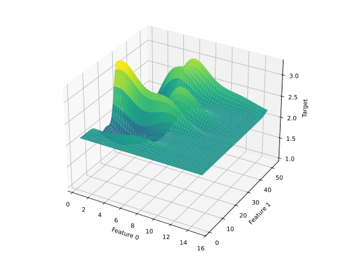
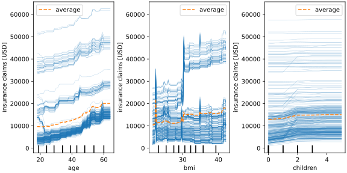
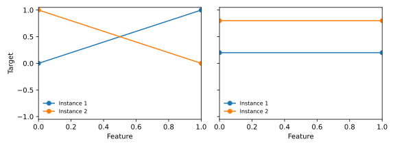

# XAI Lecture 3: Feature Variations

As a recap of the lecture on interpretable models, consider reading the `scikit-learn` page listing [common pitfalls in the interpretation of coefficients of linear models](https://scikit-learn.org/stable/auto_examples/inspection/plot_linear_model_coefficient_interpretation.html).

-

A straightforward way to interpret a model would be to look at its output for every possible value of the input.
There are a few catches with this approach, some of them are easy to solve and some are more complicated.

1. Even if **values** are available for the model, humans are not good at making sense of large tables of numbers. This can be solved by **visualising** the outputs for different values of the inputs.
1. The **dimensionality** of features is small only in toy examples. The **number of input values** to consider can be therefore very high, and direct **visualisation** is only possible for a low number of dimensions, i.e., three spatial dimensions at most (on paper two are better) plus extensions such as colour and time (videos), which however make interpretation considerably more complicated.

The basic idea of the methods explored in this lecture is to **look at the output dependence on one, at most two features at a time**.
Such a divide-and-conquer approach is very limited, as it only considers certain directions in a high-dimensional space, but is also very straightforward, which fits nicely with the low-complexity requirement.
The simplest way to start is to consider the explanation for the value of a single output.

## Ceteris Paribus

### Main idea

Given a set of feature values $\vec{x}\in\mathbb{R}^D$, consider a model $\hat{f}$ that returns an output $\hat{f}(\vec{x})$.
The dimension $D$ is greater than 3 in most scenarios, so the function $\hat{f}(\vec{x})$ cannot easily be drawn in a graph.

For a specific instance, i.e., a dataset point, it is possible to vary one feature at a time, obtain the model output and plot it.
All the **other** features are **left fixed**, hence the name of the method __ceteris__, which is latin for "the rest", __paribus__, i.e. "unchanged".

Formally, for instance number $i$ with features $\vec{x}^{(i)} = (x_1^{(i)},\dots,x_D^{(i)})$, we plot the function of one variable
$$
\mathrm{CP}^{(i)}_j(x) := \hat{f}(x_1^{(i)},\dots,x_j^{(i)}\to x,\dots,x_D^{(i)}),
$$
where the $x$ value is at position $j$.
In other words, $x_j^{(i)}$ is replaced with $x$.


### Output type

The interpretation needs to take into account if the task is regression or classification:

- For **regression** models, the model output is directly the **target quantity**.
- For **classification** models, the model output is usually the **probability** for a class.
	- Using logits or log probabilities would also be a valid option, this expands the regions close to 0 and/or 1.
	- For multi-class problems, a simple solution is to visualise the outputs for each class.


### Value range

So far it is unclear which values should be considered for $x$.
These have to be concrete numbers to obtain a plot.

For **discrete features**, either binary, categorical, or ordinal, the possible values can be listed exhaustively.
In this case, an output value should be plotted for **each possible** feature value.
Also, it is common to draw **bar plots** instead of scatter plots, since the features cannot be changed smoothly.
This is especially preferred for categorical features that cannot be sorted on the horizontal axis, because it does not make sense to join them with lines.

<!-- Example: Car price for Ford, Kia, Tesla, VW (no order); Temperature across seasons (more sense) -->

```diff
! Task
In the case of continuous features, what is a reasonable set of points
to compute the model output for?
```

For **continuous features** the choice is more tricky, as numerically computing an infinite number of outputs requires infinite time.
The most common choice is to consider the range between the **minimum and maximum** feature values on a certain dataset, which can be for instance the training or validation split or both, and consider a **uniform** grid.
Typically the number of points is chosen high enough to obtain a smooth plot, for instance in the hundreds.
If the feature has a defined compact range, one could take the minimum and maximum **values allowed** too.
Examples are the time of the day which can only change between 00:00 and 24:00, or a probability feature that can only change (continuously) between 0 and 1.
If the range is given by the minimum and maximum feature value in the dataset, the points that take the minimum feature value will have a CP plot that extends only on one side.

When this make sense, it may be useful to **extend the range** a bit further to see what would happen around the point, for instance by adding a small percentage of the range on each side---more on this later.
For now, as an example, if the operational temperature of a phone in a dataset ranges between 0 and 50 degrees Celsius, it may be worth to extend its CP plot to use a grid between -5 and 55 degrees.

A different but valid approach would be to use **all values the feature takes** in a reference dataset, again either the training or validation split or both.
This results in a non-uniform grid that is more dense where there are more data points, which may be helpful to have more resolution where the function has a lot of data to fit and might change more.

### Properties

```diff
! Task
Is this a model-agnostic or model-specific method?
Is it local or global?
```

> Ceteris paribus plots can be obtained by simply running inference on different inputs, irrespectively of how the model obtains the output.
> The method is therefore **model-agnostic**.
> 
> Ceteris paribus considers slices of the multi-dimensional feature space that intersect the point representing a **specific instance** or data point.
> Therefore the method explores a neighbourhood of the instance under consideration, and produces explanations that are only appropriate for that instance (or at least, if they explain others as well this is by accident in the general case).
> It is therefore a **local** method.

Ceteris paribus explanations are also **causal with respect to the model**.
Indeed, CP plots indicate exactly *what the output of the model would have been, had the sets of features been different*.
Note that this type of causality is confined to the model, and does not necessarily have anything to do with the physical world.
The fact that the model would have made a certain prediction given a different feature value does _not_ imply that the feature would have changed the target value in the real world.
The model may be wrong, and even if it is right, the feature and the target may well be linked by a different cause.

### Extensions beyond one dimension

High-dimensional spaces cannot be visualised effectively, so varying all features one at a time is a strategy to circumvent the issue.
However, humans can visualise statically up to three dimensions, so graphing two inputs plus the output value at the same time is possible.
The result can be shown as a **3D plot**, which is nice to look at on screens if it can be rotated interactively.
Nevertheless, 3D plots can be hard to interpret if they are exported to a static format from a single perspective or printed on paper.
An alternative that conveys the same information are **2D+colour** plots, which contain the same information in two dimensions only.
Usually one plots a box with the two features of interest on the horizontal and vertical axes, and the target as colour using a perceptually uniform scale.
In combination with contours, this gives a 2D representation which does not suffer from perspective issues and is still intuitive.
Importantly, these plots that consider two features at a time give some insight into **interaction** effects.




Another trick that can be used to consider more than one feature at once is to plot **multiple lines** or bars on the same canvas and distinguish them using different **styles** (colour or dashing or both).
This is especially effective when the feature that is distinguished by style only takes a handful of **discrete values**.
Even if the style trick can be adapted for continuous features by using a grid of values, for a fine-grained resolution in continuous features hundreds of lines may be needed, making the plot very crowded and therefore difficult to read.


```diff
! Task
Which propery of explanations does this violate?
```

To generate good explanations that have low complexity, it is best to keep the number of lines to a minimum.
Like 3D and contour plots, line plots that leverage different styles are also suitable to discover **interaction** effects between features.

<!-- 1D plot with multiple coloured lines]() -->

### Limitations

Ceteris paribus plots are a model-agnostic XAI method to generate local explanations that is very **powerful** especially thanks to its **simplicity**.
They have, however, some important limitations.

One consideration to take into account is that additional information is required to know if the model's outputs have adequate data **support**.
Support refers to having training data that is sufficiently similar to the inputs that are encountered at inference time.
When the model receives input points that are outside the feature range encountered at training time, the inference process is called **extrapolation**.
By contrast, when inputs are within the range covered by training data, the model is said to perform **interpolation**.
Extrapolation is a much less controlled process, because the model has received no signal to learn appropriate behaviour outside of the training data range, so it is essentially free to generate any output depending on its flexibility.
By definition, a model has no support when extrapolating far from the training data.
More subtly, there may well be region within the training data feature range that just happen to be poorly covered by data points.
This often happens close to the range limits, but "holes" in feature space where there is no training data are also common.
The interpolation in these regions is also not really determined by training data, and there is a risk to read meaningless values from ceteris paribus plots.

To partly circumvent this issue, it is useful to present ceteris paribus plots together with **histograms** or **rug plots** indicating the values of the feature(s) under exam that actually occur in the data.
Histrograms report the number of data points which have the feature vaule within a certain bin, or the frequency thereof.
Rug plots encode the information differently by drawing an axis with a thin line orthogonal to it for each value occurring in the data.
When several points take the exact same value, usually the lines are drawn just next to each other, therefore increasing thickness.
Another approach that is used for instance by `scikit-learn` is to plot a line for each **decile** (i.e., 10th, 20th, percentile and so on).
This gives an indication about which intervals of the feature are equally populated.
In any case, the purpose of these auxiliary plots is to indicate the feature **values where there is scarce training data**, suggesting that the model cannot be trusted and interpretation should be handled with care.

Data support information can be added to ceteris paribus plots, but it hints at a **more fundamental issue**.
The weakest point of varying features one at a time is that this does not take into account their correlations in the high-dimensional space.
The consequence is that explanations may be based on **totally unrealistic feature values**.

Consider a dataset based on a human population that has features corresponding to age, weight, and height.
The data points might look as follows:

| Age [y] | Weight [kg] | Height [m] |
| :-: | :-: | :-: |
| 2 | 14 | 0.95 |
| 6 | 20 | 1.20 |
| 14 | 59 | 1.60 |
| 18 | 79 | 1.85 |
| 25 | 50 | 1.65 |
| 45 | 69 | 1.75 |
| 48 | 65 | 1.70 |
| 80 | 75 | 1.70 |

When the fourth row of this table (age 18 y, weight 79 kg, height 1.85 m) is explained with ceteris paribus, this generates individuals that are 2 year old with a large grown-up body, or that are 1.85 m tall and only weigh 50 kg.

The example should highlight that ceteris paribus can very quickly generate explanations **based on data points that do not make sense**.
The model may be producing outputs in a feature space region completely without support because the method **does not respect feature interactions**.
Since only one or very few features at a time can be varied, even keeping track of support with histograms or rug plots may be utterly insufficient and produce false confidence.
As any other XAI method, interpretation of results should be handled with **care**.


## Individual Conditional Expectations

### Definition

Multiple ceteris paribus plots can be used to obtain a representation of what is happening in a dataset.
The basic idea is that, given a **set of data points**, **one line plot for each** of them can be drawn on the same canvas.
The procedure can then be repeated once for every feature.
This idea is sufficiently popular to have earned its own name, **Individual Conditional Expectations** or **ICE** in short.

As observed [above](#Extensions-beyond-one-dimension), many lines on the same plot can be confusing and increase complexity.
To mitigate this there are several tricks that can be used.



- In almost any practical situation, lines are drawn with **transparency**, so that more frequent trends are visible through regions of more marked colour.
- The **same colour and style** is typically used for all lines, since each represents a data point that should be equivalent.
- If the dataset is large, usually more than a few hundred points in practice, a **random subsample** can be used to make the plot more readable.
- The **vertical displacement** of the lines is informative, since it shows the actual output values for each data point. However, if the focus is on *variations* due to feature changes, it is common to vertically align the lines. One option is to subtract the output at the minimum feature value for each point, alignment at different points is possible but not common. This operation is sometimes called **centring**.


### Properties

ICE plots are clearly **model-agnostic** as the ceteris paribus plots they are based on.
Despite a number of lines being plotted for individual instances, the plot discards the identity of each and considers them collectively.
Therefore, depending on the group of data points that is considered, ICEs can be considered in **between a fully local and a fully global method**.
As the number of data points grows to cover a whole dataset, the global character becomes more and more prominent.

## Partial Dependence Plots

Individual Conditional Expectation plots easily get crowded as the size of datasets increases, and may therefore not be interpretable unless subsampling is applied, which makes them poor representatives of the whole dataset.
Luckily there is a straightforward way to summarise all ICEs with a single line.

### Definition

The **average** of a group of ceteris paribus plots with respect to a given feature is called the **Partial Dependence Plot (PDP)** with respect to the same feature,
$$
\mathrm{PDP}_j(x) := \frac{1}{N} \sum_{i=1}^N \mathrm{CP}^{(i)}_j(x) = \frac{1}{N} \sum_{i=1}^N \hat{f}(x_1^{(i)},\dots,x_j^{(i)}\to x,\dots,x_D^{(i)}).
$$
This is often drawn together with ICE plots, as done in the plots above where the average dashed orange line is in fact the PDP.

### Theory interpretation

Partial dependence plots have a nice theoretical interpretation.
In fact, the average in the PDP definition can be seen as an estimate of the **expectation value** over the dataset of the model output, when the features under exam are fixed to specific values
$$
\mathrm{PDP}_j(x)
= \mathbb{E}_{\vec{x}^{(i)}}\left[\mathrm{CP}^{(i)}_j(x) \right]
\to \mathbb{E}_{\vec{x}}\left[\hat{f}(x_1,\dots,x_j\to x,\dots,x_D) \right].
$$
The estimate is just the best one that can be obtained given the data, i.e., the joint distributions of the remaining features is approximated by the data points themselves.

> **Digression:** Optimal models
> 
> Partial dependence plots are not limited to explaining black-box models.
> They can also be applied to obtain **optimal predictors and classifiers** when exact relationships are known, thus clarifying the functional role of marginalisation.
> 
> In **regression**, suppose the perfect relationship between features and target is known
$$
y = f(\vec{x}).
$$
> If only a certain subset of features $\vec{x}_S$ are observed, with $\vec{x} = (\vec{x}_S, \vec{x}_{\bar{S}})$, determining the optimal predictor with partial information involves **marginalisation**
$$
f(\vec{x}_S)
= \mathbb{E}[y\mid\vec{x}_S]
= \int\mathrm{d}\vec{x}_{\bar{S}}\,f(\vec{x}_S,\vec{x}_{\bar{S}}).
$$
> This is precisely the same operation performed when the 
> In a sense all models with partial knowledge, even the optimal ones, are partial dependences.
>
> In **classification**, the perfect description of a system corresponds to knowing the joint probability distribution
$$
p_y = p(y\mid\vec{x}).
$$
> The corresponding classifier,
$$
f(\vec{x}) = \arg\max_y p(y\mid\vec{x}).
$$
> is called the **Bayes classifier**.
> Also in this case, when only certain values are observed, the optimal model with partial knowledge is the marginal distribution
$$
p(y\mid\vec{x}_S)
= \mathbb{E}_{\vec{x}_{\bar{S}}}[p(y\mid\vec{x}_S,\vec{x}_{\bar{S}}]
= \int\mathrm{d}\vec{x}_{\bar{S}}\,p(y\mid\vec{x}_S,\vec{x}_{\bar{S}}).
$$
>
> In this sense, partial dependence plots applied to full knoweldge of a system correspond to **optimal models** under partial information through marginalisation.


### Properties

Once more, partial dependence plots are **model-agnostic** as they can be used with any model as long as it is possible to run inference with it enough times.
It is typically considered a **global** method as in the most common case the average is taken over the whole dataset.

### Limitations

PDPs are derived from ceteris paribus plots, and as such they suffer from the same limitations, especially not considering interactions and generating explanations based on unrealistic points.
However, there is one more effect that is worth noting.

```diff
! Task
Draw the PDP given the following two ICE plots
for two datasets with two instances.
```



Since the ICE plots are **aggregated** through averaging, information is discarded and it is no longer possible to know if the behaviour of the model is **consistent or heterogeneous** across the data, as effects might **compensate** each other.


## Accumulated Local Effects

**Accumulated Local Effect (ALE)** plots are a method that improves on partial dependence by binning the data according to the value of the feature under exam.
The idea is that, for each feature value, **only the data points with similar feature values contribute to the average**.
This is achieved by computing the average for each bin with data variations only for the data points points that fall within that bin.
The bin limitation avoids extrapolating the model to feature values that are far away from real data points, and effectively corresponds to limiting the starting cetris paribus plots to a neighbourhood of the generating data point.


While the idea is very simple, there are two technical details that should be highlighted:

- **Binning** is typically performed according to the **quantiles** of the feature distribution to follow the data support. With a uniform grid one would obtain the PDP with a number of data points that can change a lot from bin to bin, and in some cases there could even be no data points in one of the intervals, so it would be impossible to draw a line.
- Since each interval uses different data points, nothing guarantees that the target value at the higher end of an interval coincides with the target value at the lower end of the next. The plot could therefore feature discontinuities. To avoid this unintuitive behaviour, ALE plots are drawn **starting from one bin** and vertically **shifting** adjacent bin lines so they join smoothly. This is where the term *accumulated* comes from, while *local* refers to limiting the generating CP plots to a small interval around the feature value.

It should be noted that ALE plots actually **average** all instances in a given interval, so they do not describe a single data point and are therefore a **global** model-agnostic method.

## Exercises

### Exercise 3.1: Resolving ambiguities

Consider the following Partial Dependence Plot for two features.


1. Is the variation of the target with feature 1 smaller than the variation of the target with feature 2?
2. Which type of plot can provide more information for the behaviour of different data points?

### Exercise 3.2: Code PDP from ICEs

Assume the target values of the ICE plots for a given dataset and model are stored in a `numpy` array `y`, where `y[i]` is the CP plot for the instance with index `i`.
Without using libraries or Large Language Models, write the short one-line code to compute the array that corresponds to the target values for the partial dependence plot.
You may consult the `numpy` documentation if needed.
